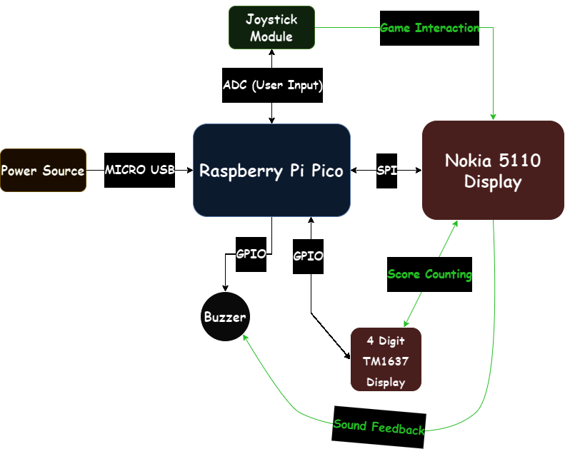
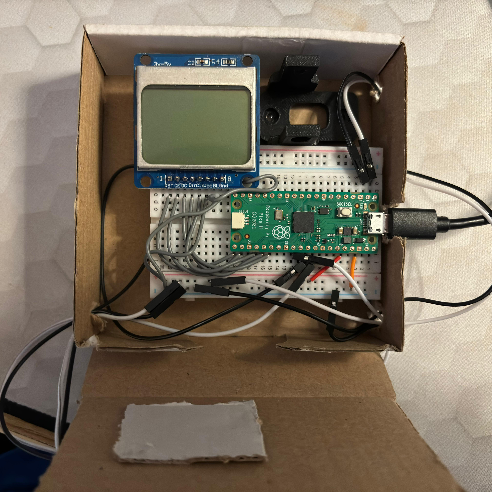
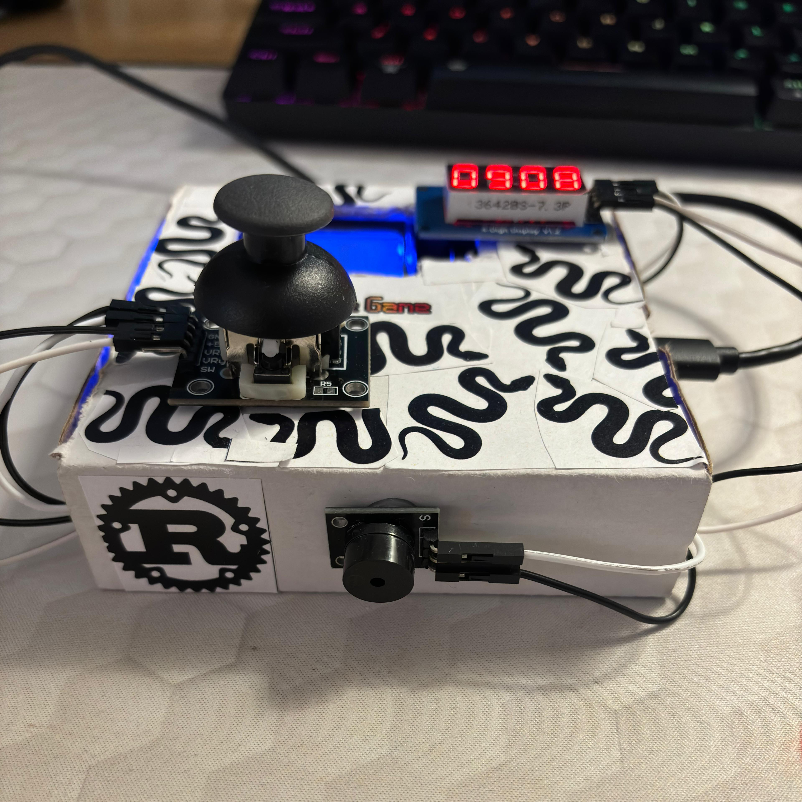
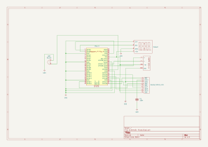

# Pico Snake Game ~ Finished on 30th of May 2024
A game written in rust for embedded systems that resembles the classic Nokia Snake Game. (RP2040 only)

## Description

This projects resembles the classic Nokia Snake Game. You control the Snake using a 2-axis joystick. Your score is updated live on a 4 digit display (maximum score is 9999, then it resets). For every interaction with "food", a buzzer will play a sound. If you eat yourself, it's game over and you have to start again. You can also pass through walls (clearly a choice, not a bug!). The game itself is displayed on an actual Nokia 5110 LCD-like display. Good luck and enjoy!

## Architecture 



## Hardware
### Pictures
<table>
<tr>
<td>
  


</td>
<td>
  


</td>
</tr>
<tr>
<td>
  


  </td>
<td>
  


</td>
</tr>
</table>

### Usage of components

- **Joystick Module** is used for controlling the snake and it's connected to ADC pins such that the analog voltage is converted to digital values.
- **Passive Buzzer** is used for *beeping* in various situations (sound feedback).
- **Nokia 5110 Display** is used for displaying the game.
- **TM1637 Module** is used for keeping track of the score while playing.
- **Raspberry Pi Pico H** is used as the main component (microcontroller) responsible for processing input data.
- **Breadboard** is used for connecting every pin of the hardware components.

### Schematics



## Software

| Library | Description | Usage |
|---------|-------------|-------|
| [embassy](https://github.com/embassy-rs/embassy) | Rust framework for embedded programming |  Used for writing correct, safe and asynchronous code, particularly targeted at embedded systems |
| [pcd8544 (modified)](https://github.com/septimium/pcd8544-embassy-rp) | Rust crate for PCD8544 displays forked and modified so it is compatible with embedded-graphics | Used for initiliazing and writing on the PCD8544 display |
| [tm1637-embedded-hal](https://crates.io/crates/tm1637-embedded-hal) | Rust crate for TM1637 microcontroller | Used for controlling the TM1637 module |
| [embedded-snake (modified)](https://github.com/septimium/embedded-snake-rs) | Rust crate for Snake Game mechanics forked and modified so it has more functions | Used for implementation of the proper Snake Game |
| [rand](https://crates.io/crates/rand) | Rust crate for random number generating | Used for creating a random position for the "food" |
| [embedded-graphics](https://crates.io/crates/embedded-graphics) | Rust crate for drawing graphics on small displays | Used for displaying the game |

## How to build and run on the RP2040 chip

Assuming you have made all the connections right, you can safely follow the next steps:

Firstly, we have to compile the project using `cargo build`.
```shell
cargo build
```

Then, you will need to compile your executable specifically for the RP2040 chip. This chip is based on the ARM Cortex M0+ architecture, so you need to specify our target when compiling.
```shell
cargo build --release --target thumbv6m-none-eabi
```

After the build is finished, make sure your RP2040 chip is in **BOOT MODE**. To put it in this mode, you need to **hold the `BOOTSEL` button down**  while connecting it to your PC.

After connecting the board to your PC and compiling the program, locate the binary in the `target/thumbv6m-none-eabi/release/` folder then, run:

```shell
elf2uf2-rs -d -s /path/to/your/binary
```

* `-d` to automatically deploy to a mounted pico
* `-s` to open the pico as a serial device after deploy and print serial output
  
On `Windows`, you may need to run this command in a terminal that has **Admin Privileges**.

That's it. You can now play the game!
